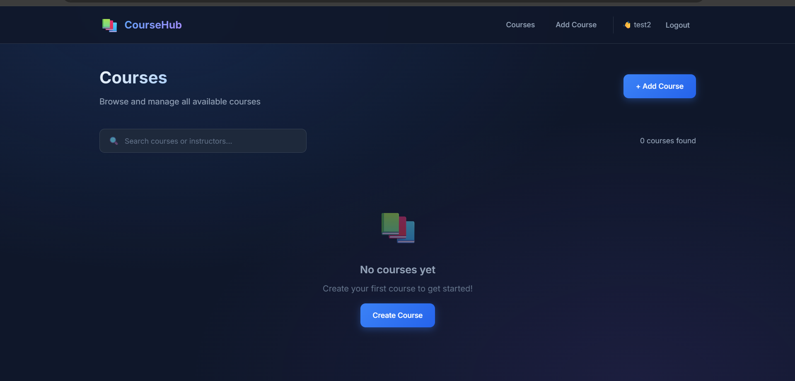
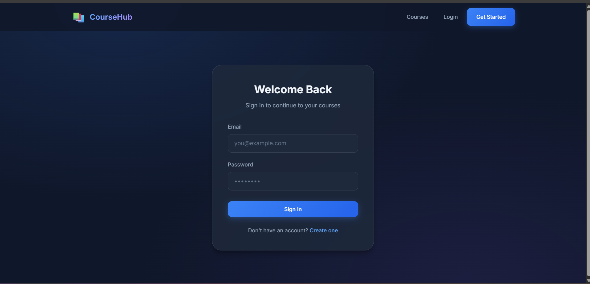
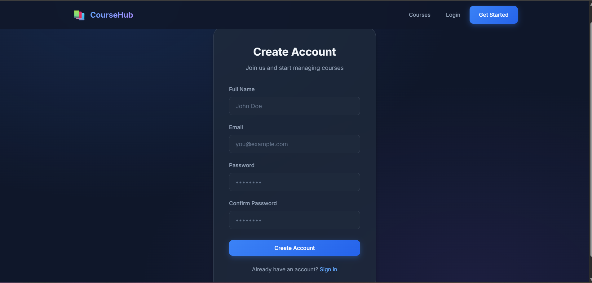
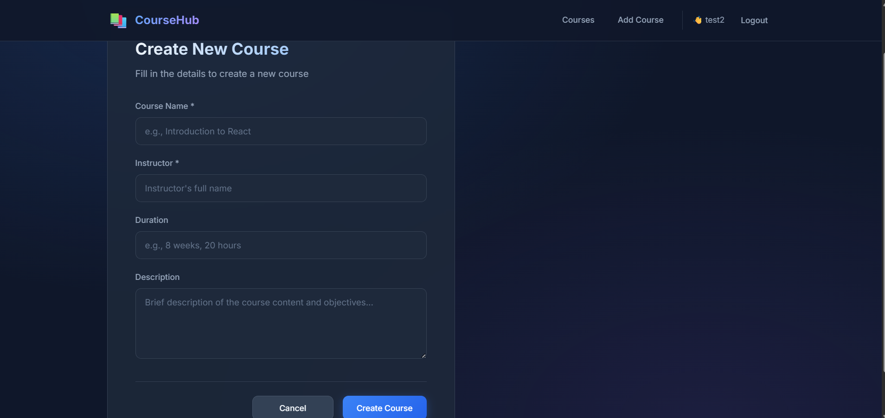
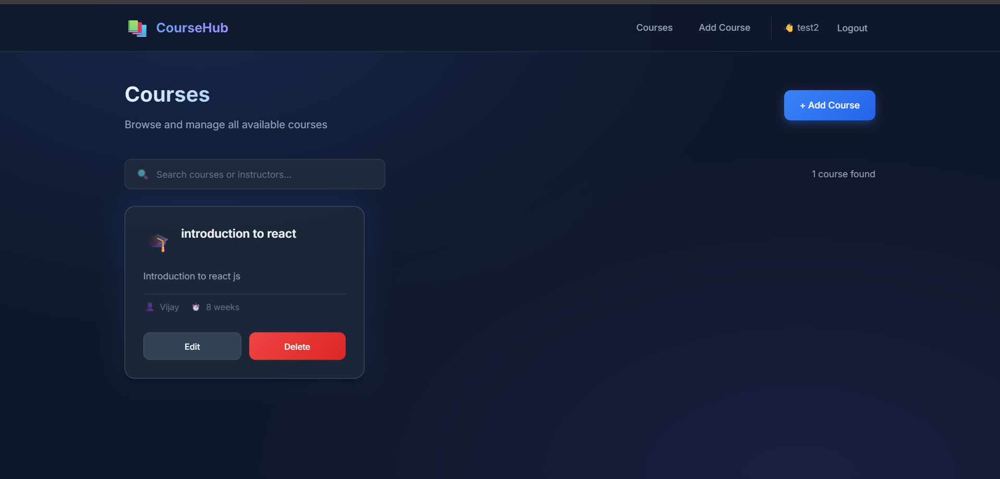

# Course Management Application

A full-stack web application for managing courses, built with the MERN stack using SQLite as the database.


## 🚀 Tech Stack

| Layer              | Technology                       |
| ------------------ | -------------------------------- |
| **Frontend**       | React 18, Vite, React Router DOM |
| **Backend**        | Node.js, Express.js              |
| **Database**       | SQLite (sql.js)                  |
| **Authentication** | JWT (jsonwebtoken), bcryptjs     |
| **Validation**     | express-validator                |
| **Styling**        | Vanilla CSS (Modern Dark Theme)  |

## ✨ Features

### Authentication

- ✅ User Registration with validation
- ✅ User Login with JWT token
- ✅ Password hashing with bcryptjs
- ✅ Protected routes for authenticated users

### Courses CRUD

- ✅ Create new courses
- ✅ View all courses with search functionality
- ✅ View course details
- ✅ Edit/Update courses (authenticated)
- ✅ Delete courses (authenticated)

### UI/UX

- ✅ Modern dark theme with glassmorphism effects
- ✅ Responsive design for all devices
- ✅ Smooth animations and transitions
- ✅ Form validation with error messages

## 📁 Project Structure

```
enegtec.ai/
├── backend/
│   ├── config/
│   │   └── database.js         # SQLite connection
│   ├── middleware/
│   │   └── auth.js             # JWT verification
│   ├── models/
│   │   ├── user.js             # User operations
│   │   └── course.js           # Course operations
│   ├── routes/
│   │   ├── auth/
│   │   │   ├── register.js     # POST /api/auth/register
│   │   │   └── login.js        # POST /api/auth/login
│   │   └── courses.js          # Courses CRUD routes
│   ├── validators/
│   │   ├── authValidator.js
│   │   └── courseValidator.js
│   ├── .env
│   ├── server.js
│   └── package.json
├── frontend/
│   ├── src/
│   │   ├── components/
│   │   │   ├── Navbar.jsx
│   │   │   ├── CourseCard.jsx
│   │   │   └── ProtectedRoute.jsx
│   │   ├── context/
│   │   │   └── AuthContext.jsx
│   │   ├── pages/
│   │   │   ├── Home.jsx
│   │   │   ├── Login.jsx
│   │   │   ├── Register.jsx
│   │   │   ├── Courses.jsx
│   │   │   └── CourseForm.jsx
│   │   ├── services/
│   │   │   └── api.js
│   │   ├── App.jsx
│   │   └── main.jsx
│   ├── index.html
│   ├── vite.config.js
│   └── package.json
└── README.md
```

## 🛠️ API Endpoints

### Authentication

| Method | Endpoint             | Description       | Auth |
| ------ | -------------------- | ----------------- | ---- |
| POST   | `/api/auth/register` | Register new user | No   |
| POST   | `/api/auth/login`    | Login user        | No   |

### Courses

| Method | Endpoint          | Description       | Auth |
| ------ | ----------------- | ----------------- | ---- |
| POST   | `/api/courses`    | Create course     | Yes  |
| GET    | `/api/courses`    | Get all courses   | No   |
| GET    | `/api/course/:id` | Get single course | No   |
| PUT    | `/api/course/:id` | Update course     | Yes  |
| DELETE | `/api/course/:id` | Delete course     | Yes  |

## 🏃 How to Run Locally

### Prerequisites

- Node.js (v16 or higher)
- npm or yarn

### Backend Setup

```bash
# Navigate to backend folder
cd backend

# Install dependencies
npm install

# Start the server
npm run dev
```

The backend will run on `http://localhost:5000`

### Frontend Setup

```bash
# Navigate to frontend folder
cd frontend

# Install dependencies
npm install

# Start the development server
npm run dev
```

The frontend will run on `http://localhost:5173`

## 🔐 Environment Variables

Create a `.env` file in the `backend` folder:

```env
PORT=5000
JWT_SECRET=your_super_secret_jwt_key_change_in_production
NODE_ENV=development
```

## 📸 Screenshots

### Home Page

Modern landing page with hero section and features showcase.

### Courses List

Browse all courses with search functionality and grid layout.


### Login / Register

Clean authentication forms with validation feedback.



### Course Management

Create and edit courses with intuitive form interface.



## 🚀 Deployment

### Backend (Render)

1. Create a new Web Service on Render
2. Connect your GitHub repository
3. Set build command: `npm install`
4. Set start command: `npm start`
5. Add environment variables

### Frontend (Vercel/Netlify)

1. Connect your GitHub repository
2. Set build command: `npm run build`
3. Set publish directory: `dist`
4. Add environment variable: `VITE_API_URL=your-backend-url`

## 📝 License

MIT License - feel free to use this project for learning and development.

---

Built with ❤️ using the MERN Stack + SQLite
